# Tianze Design Workflow

> Last updated: 2026-04-30
> Scope: project-level design workflow for Tianze website and active design-skill routing.

这份文档定义 Tianze 网站的设计工作流。它不是某个单独页面的设计稿，也不是某个 skill 的使用说明。

核心目的：让后续所有设计、动效、视觉 polish、图片生成和 skill 调整，都先服务项目真实业务，而不是变成“看到一个好 skill 就装一个”。

Current boundary: Tianze design work starts from the live site, current components, `PRODUCT.md`, `DESIGN.md`, `docs/design-truth.md`, and confirmed Impeccable system docs. External generated-design pipelines are not part of the project workflow unless the owner explicitly introduces one later.

## 1. One-line principle

Tianze 的设计不是为了让页面更炫，而是为了让海外买家更快判断：

> 这是不是一个可信、懂产品、有制造能力、值得询盘的供应商？

所以每次设计任务都必须先回答：

1. 买家此刻在判断什么？
2. 页面有没有降低他的疑虑？
3. 信息层级有没有帮助他快速做决定？
4. 视觉和动效有没有增强可信感，而不是抢戏？
5. 最后有没有推动询盘？

## 2. North Star: qualified inquiry

整站北极星只有一个：

> 让合适的海外买家愿意发出有效询盘。

有效询盘不是单纯点击按钮，而是买家已经理解了产品范围、供应商可信度、制造能力、合作方式，并愿意带着需求进入下一步沟通。

每个页面或模块都要说明自己如何贡献询盘，而不是只写“主 CTA / 次 CTA”。

| Inquiry contribution mode | Meaning | Typical pages |
| --- | --- | --- |
| Direct conversion | 直接推动提交询盘、报价、样品或技术沟通 | Contact, Product detail, OEM |
| Trust paving | 先建立供应商可信度，为后续询盘铺垫 | Homepage, About, Capability |
| Objection removal | 解决标准、MOQ、质量、交期、定制等顾虑 | Product detail, OEM, FAQ |
| Entry distribution | 帮买家快速进入正确产品、市场或需求路径 | Homepage, Product listing |

如果一个页面无法说明询盘贡献模式，先不要动视觉。

## 3. Gate 0: is this really a design problem?

设计任务启动前先过一道前置闸：

> 这是设计问题，还是内容、证据、业务承诺、产品结构问题？

常见判断：

| Symptom | Do not start with | First check |
| --- | --- | --- |
| 页面不可信 | 换颜色或加动效 | 是否缺少工厂、质检、标准、流程证据 |
| 产品页弱 | 重做卡片样式 | 规格、应用、标准、MOQ、样品路径是否清楚 |
| 首页像模板 | 加复杂视觉 | 是否有 Tianze 独有的制造事实 |
| CTA 转化弱 | 放大按钮 | CTA 前的疑虑是否被解除 |
| 页面太空 | 增加装饰图形 | 是否缺少真实产品、工艺、包装、案例内容 |

原则：

- 如果缺的是证据，不要用设计装饰去掩盖。
- 如果缺的是业务承诺，不要让 AI 先调视觉。
- 如果信息结构不对，先重排内容，再谈颜色、动效和组件。

## 4. Project design flow

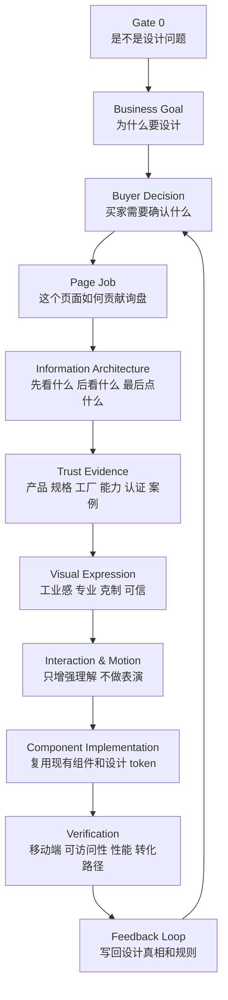

关键点：

- 不从颜色、动画、组件开始。
- 先从买家决策和业务目标开始。
- 设计的最终判断标准不是“好不好看”，而是“是否更可信、更清楚、更容易询盘”。

## 5. Buyer decision path

海外 B2B 买家通常不是来浏览灵感，而是在降低采购风险。


设计要服务这条判断链。

| Page area | Primary buyer question | Design implication |
| --- | --- | --- |
| Homepage | 这是不是靠谱工厂？ | 先建立制造能力和专业可信，不做纯视觉 demo |
| Product listing | 我能不能快速找到对应产品？ | 分类清楚，规格和应用优先 |
| Product detail | 这个产品是否适配我的项目？ | 标准、尺寸、材质、应用场景要清楚 |
| OEM / Custom | 你们能不能做非标？ | 展示模具、打样、工艺和流程 |
| About / Capability | 你们是不是真有能力？ | 工厂、质量、产能、经验作为证据 |
| Contact / Inquiry | 我发需求是否方便、安全、有反馈？ | 表单清晰、反馈明确、风险感低 |

## 6. Page job contract

每个页面或模块开始前，先写一个轻量合同。

```text
页面目的：
询盘贡献模式：直接转化 / 信任铺垫 / 答疑除障 / 入口分发
主目标买家：
次目标买家：
内容平衡策略：
用户核心疑问：
必须出现的证据：
主 CTA：
次 CTA：
失败时的退路：
不该出现的干扰：
```

页面不能同时承担所有任务。每个页面必须有一个主任务。

| Page type | Main job |
| --- | --- |
| Homepage | 建立第一信任，并引导进入产品或询盘 |
| Product category | 帮买家快速找到对应系列 |
| Product detail | 让买家确认规格、标准和应用适配 |
| OEM / Custom | 证明定制、模具和制造能力 |
| About | 证明公司可信，不是空壳贸易 |
| Contact | 让用户无压力提交需求 |

### Persona rule: prioritize, do not fork pages yet

当前阶段不做 persona-specific page variants。也就是说，同一个 Product 页不会为分销商、承包商、OEM 采购分别做不同版本。

但每个页面仍然必须有 persona 字段，用来决定：

- 首屏优先回答谁的问题。
- 证据顺序怎么排。
- 哪类信息放正文，哪类信息放 FAQ、表格、折叠区或次级 CTA。
- CTA fallback 是报价、样品、规格下载，还是技术沟通。

推荐写法：

```text
主目标买家：工程承包商
次目标买家：分销商、OEM 采购
内容平衡策略：
- 首屏先讲标准和规格适配，服务工程承包商。
- 产品卡和 FAQ 补 MOQ、包装、批量供应，服务分销商。
- 末段放定制入口，服务 OEM 采购。
```

这样保留买家差异，但不增加当前不可维护的多版本复杂度。

## 7. Information architecture sequence

B2B 页面优先解决“信息顺序”，再谈视觉表现。

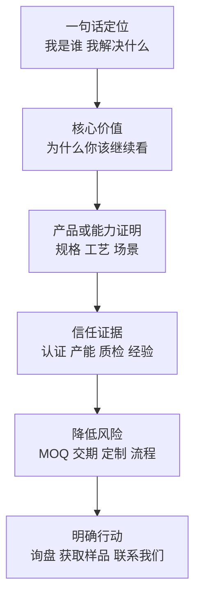

如果页面信息顺序不对，不要优先改颜色、动画或图片。

## 8. Trust evidence system

Tianze 的信任感来自证据结构，而不是装饰。

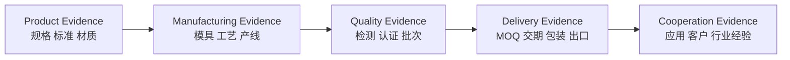

设计要做的是：

- 把证据排清楚。
- 让重点容易扫读。
- 不让装饰盖过证据。
- 不把制造业网站做成通用 SaaS 模板。

## 9. Visual direction

Tianze 当前视觉方向：

- B2B manufacturing
- Professional and trustworthy
- Modern but restrained
- Industrial, not playful
- Precise, not flashy
- Factory-backed, not pure trading

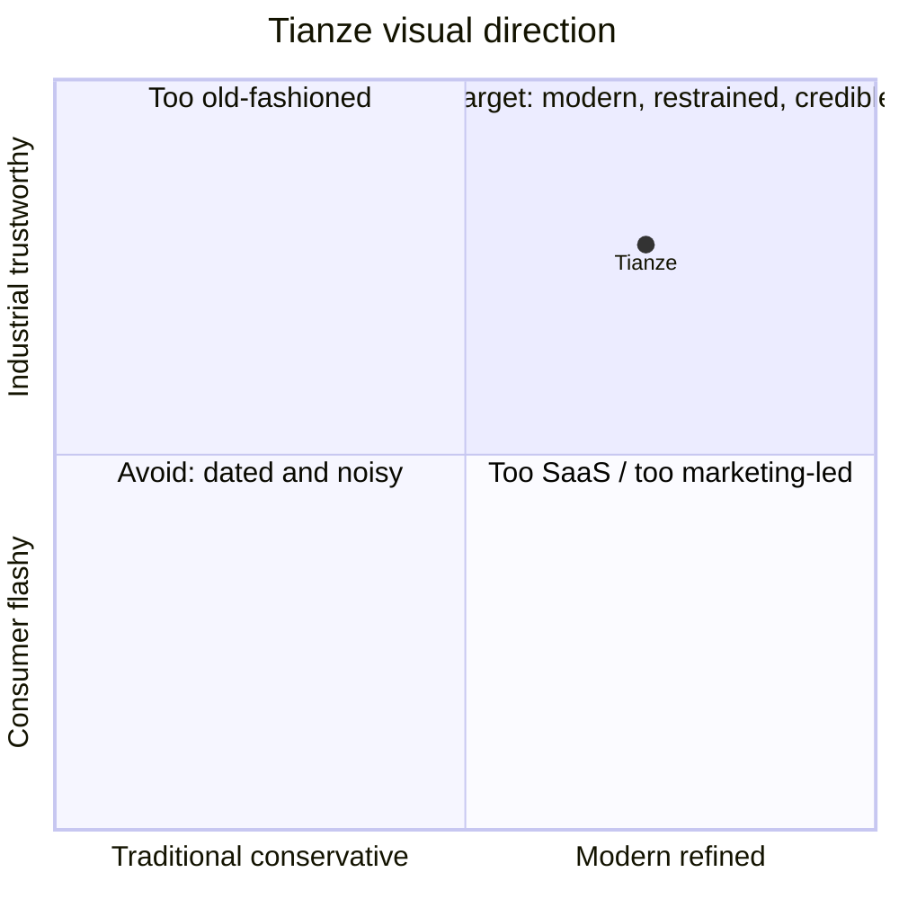

Default avoid:

- Over-rounded SaaS surfaces
- Heavy glow
- Large decorative gradients
- AI landing-page tropes
- Hero sections that feel like a tech demo
- Visual choices that weaken manufacturing credibility

### Current token status

现有 token 是当前实现基线，不是最终视觉身份。

稳定可继承：

- 1080px 内容宽度和清晰网格秩序。
- 克制的 steel blue 主色基线。
- 4px / 8px 系列间距与圆角纪律。
- 轻阴影和 shadow-border 的精密感。
- 交互动效通常低于 300ms。

暂不固化为最终：

- 最终品牌色是否就是当前 `#004d9e`。
- Grid 装饰在全站的使用范围。
- Hero 产品视觉到底偏实拍、场景、技术图纸，还是混合。
- 卡片阴影和圆角是否已经达到最终工业质感。
- 动效语言是否需要更独特的制造业表达。

## 10. Motion layer

Motion is a support layer, not the design starting point.

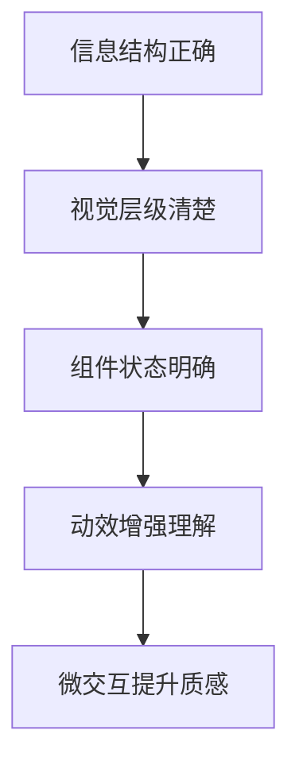

Motion rule:

> 如果动画让用户更清楚发生了什么，就保留。
> 如果动画只是让开发者觉得酷，就删掉。

Suitable motion areas:

| Scenario | Fit | Reason |
| --- | --- | --- |
| Navigation dropdown | Good | Helps users understand hierarchy |
| Form submit state | Strong | Gives feedback and reduces uncertainty |
| Inquiry drawer / modal | Good | Makes appearance and dismissal less abrupt |
| Product card hover | Good, restrained | Signals clickability |
| Large homepage spectacle | Caution | Can reduce manufacturing credibility |
| Complex page transition | Low priority | Limited direct conversion impact |

Technical constraints:

- Prefer `transform` and `opacity`.
- Respect `prefers-reduced-motion`.
- Keep interaction motion usually under 300ms.
- Do not add a heavy animation runtime unless the business case is strong.

## 11. Workflow A: new page or new module

Use this for new landing pages, product pages, OEM pages, factory capability pages, or new conversion modules.

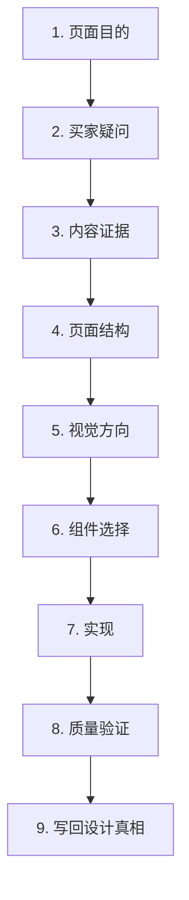

| Step | Output |
| --- | --- |
| 页面目的 | 一句话目标 |
| 买家疑问 | 用户需要被说服的点 |
| 内容证据 | 规格、工厂、流程、认证、案例 |
| 页面结构 | Section order |
| 视觉方向 | 克制、工业、可信、现代 |
| 组件选择 | 复用哪些现有组件 |
| 实现 | Production code |
| 验证 | 移动端、可访问性、性能、转化路径 |
| 写回 | 更新 docs、rules、patterns |

## 12. Workflow B: existing page optimization

Use this when a page feels unclear, generic, weak, noisy, visually off, or underperforming.

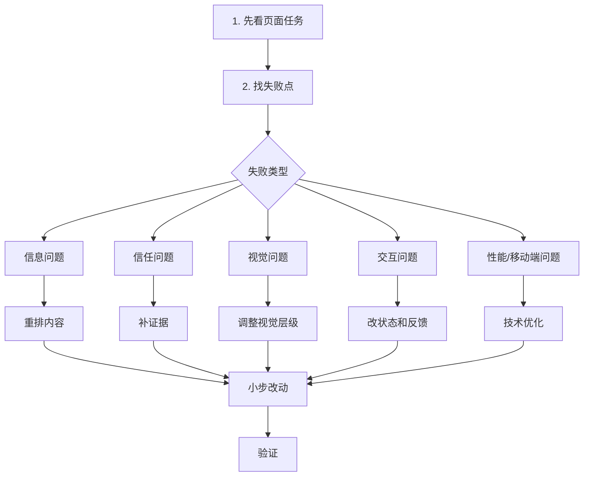

Failure mapping:

| Symptom | Likely failure | First response |
| --- | --- | --- |
| 用户不知道 Tianze 是工厂 | Trust evidence | 补制造、工艺、产线、质量证据 |
| 用户找不到规格 | Information architecture | 重排产品信息和规格表 |
| 页面太普通 | Visual hierarchy | 调整布局、比例、留白、层级 |
| 页面太花 | Brand fit | 降噪、减少装饰、降低动效 |
| 点击后没有反馈 | Interaction state | 补 hover、active、loading、success |
| 手机上难用 | Adaptation | 先修移动端布局和触控目标 |

## 13. Workflow C: motion and polish

Use this for dropdowns, drawers, form states, icon swaps, hover feedback, loading states, and small perceived-quality improvements.

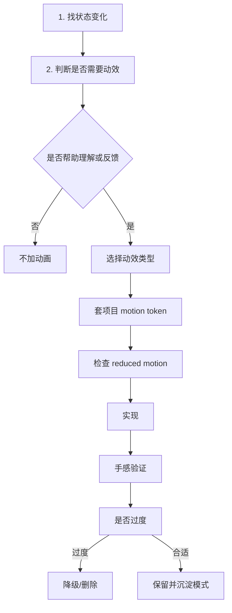

Motion acceptance:

- The motion clarifies a state change.
- It does not slow the user down.
- It does not distract from product evidence or CTA.
- It works with reduced motion.
- It uses project timing and easing tokens where possible.

## 14. Workflow relationship

真实工作经常是混合场景，默认关系如下：

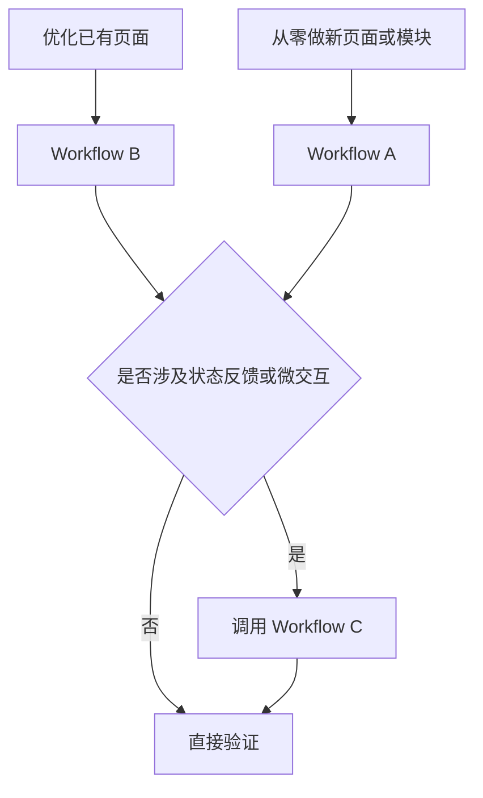

使用规则：

- Workflow A：从零起步的新页面、新模块、新转化区。
- Workflow B：默认入口，用于已有页面优化。
- Workflow C：不是独立入口，通常被 A 或 B 调用，用来处理 hover、loading、drawer、dropdown、form feedback 等动效细节。

例子：“优化产品页同时加一点 hover 反馈”走 Workflow B，到了交互状态步骤再调用 Workflow C。

## 15. Gate 0 + Five design gates

### Gate 0: Problem fit

Pass if:

- The team has identified whether the issue is design, content evidence, business promise, product structure, or implementation.
- Missing proof is not being hidden behind decoration.
- The task has a clear inquiry contribution mode.

### Gate 1: Business fit

Pass if:

- It supports a clear business goal.
- It maps to a real page or user path.
- It is not just subjective taste.

### Gate 2: Buyer clarity

Pass if:

- The primary message is scannable within 5 seconds.
- Specs, capability, and trust evidence are not buried.
- CTA placement is obvious.

### Gate 3: Brand fit

Pass if:

- It feels professional, restrained, industrial, and credible.
- It does not feel like a generic SaaS template.
- It does not feel like AI-generated visual filler.

### Gate 4: Interaction fit

Pass if:

- Hover, active, loading, success, and error states are clear.
- Forms provide feedback.
- Mobile and keyboard usage are not broken.

### Gate 5: Shipping fit

Pass if:

- It does not hurt performance.
- It does not break i18n.
- It respects reduced motion.
- It can be verified with the smallest relevant check.

## 16. Design task template

Use this before larger UI work:

```text
目标：
这次设计要解决什么业务问题？

用户：
主目标买家是谁？次目标买家是谁？他们分别在判断什么？

询盘贡献模式：
直接转化 / 信任铺垫 / 答疑除障 / 入口分发？

页面/组件任务：
这个页面或组件要促成什么动作？

必须呈现的证据：
产品、规格、工厂、质量、交付、定制、案例里哪些必须出现？

内容平衡策略：
哪些信息进首屏？哪些进入正文、表格、FAQ 或次级 CTA？

设计方向：
应该更专业、更清晰、更克制、更有信任，还是更有视觉冲击？

限制：
不能牺牲什么？例如性能、移动端、i18n、转化路径、可访问性。

失败退路：
如果用户还不愿意询盘，应该给他什么低承诺下一步？

验收：
怎样算做好？用户能更快理解？CTA 更明确？表单更顺？
```

## 17. Skill routing model

Skills should serve the workflow, not define the workflow.

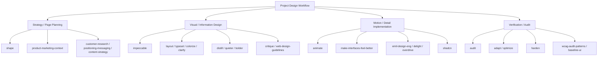

Default routing:

| Need | First skill |
| --- | --- |
| Define project-level design operating model | `impeccable document` + manual synthesis |
| Explore visual moodboard / hero direction | `imagegen` |
| Plan a specific new feature/page | `shape` |
| Clarify positioning or page message | `positioning-messaging`, `content-strategy`, `copywriting`, `copy-editing` |
| Check buyer/ICP assumptions | `customer-research` |
| Improve overall UI quality | `impeccable` |
| Fix layout rhythm | `layout` |
| Fix typography | `typeset` |
| Fix color emphasis | `colorize` |
| Fix unclear labels, instructions, form hints, or error copy | `clarify` |
| Reduce noise | `distill` or `quieter` |
| Make an overly safe section more noticeable | `bolder`, only after Gate 3 brand fit |
| Add small moments of personality | `delight`, only when it strengthens trust or conversion |
| Improve small interaction/detail feel | `make-interfaces-feel-better` |
| Decide whether to animate | `animate` |
| Implement small motion details | `make-interfaces-feel-better`, `emil-design-eng`, CSS / Tailwind |
| Push a high-impact visual or motion experiment | `overdrive`, only with explicit owner approval |
| Compose or repair shadcn-based UI | `shadcn`, only after the page/component contract is clear |
| Harden against real data, errors, i18n, and edge cases | `harden` |
| Check WCAG accessibility | `wcag-audit-patterns` |
| Check Tailwind UI baseline | `baseline-ui` as checklist only |
| Review against modern web design guidelines | `web-design-guidelines` |
| Verify technical UI quality | `audit`, `adapt`, `optimize` |
| Final pass | `polish` |

### Design routing rule

The design chain is:

```text
business goal -> buyer decision -> evidence -> information architecture -> visual system -> component implementation -> verification
```

Rules:

- Do not ask agents to extract, convert, or iterate from external generated-design projects unless the owner explicitly changes the workflow.
- Do not treat generated screens, generated prompts, or generated component dumps as source material.
- If active tooling contains compatibility wording for older `DESIGN.md` formats, treat it as parsing compatibility only, not as workflow direction.
- New design-system work starts from the live site, current components, `PRODUCT.md`, `DESIGN.md`, `docs/design-truth.md`, and confirmed Impeccable system docs.

## 18. Image generation usage

Image generation is useful for visual direction and marketing assets. It should not replace editable workflow documentation or component design.

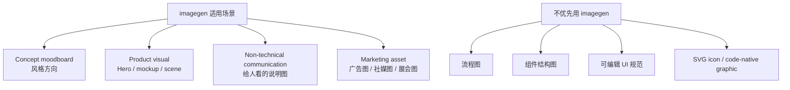

For Tianze, image generation should follow these constraints:

- Industrial, clean, credible.
- Avoid fantasy factory scenes.
- Avoid over-polished plastic SaaS aesthetics.
- Prefer real-world material cues: PVC conduit, PETG tube, fittings, clean warehouse, production bench, inspection tools, export packaging.
- No fake certificates, fake logos, unreadable decorative text, or claims that are not supported by content.

## 19. Feedback loop

“写回设计真相和规则”必须有明确目的地和触发时机。

### Write-back destinations

| Destination | What belongs there |
| --- | --- |
| `PRODUCT.md` | Business goal, buyer personas, positioning, inquiry model |
| `DESIGN.md` | Current design operating model, token boundaries, visual guardrails |
| `docs/design-truth.md` | Confirmed design truths that should outlive experiments |
| `docs/impeccable/design-workflow.md` | Workflow rules, gates, skill routing |
| `docs/impeccable/system/PAGE-PATTERNS.md` | Reusable page structures and component usage patterns |
| `docs/impeccable/system/MOTION-PRINCIPLES.md` | Motion principles and implementation boundaries |

### Trigger moments

Write back when:

- A new page or major module launches.
- A redesign changes visual direction or page structure.
- The same design issue appears twice.
- A design dispute gets resolved.
- A new design or motion skill is adopted.
- A pilot page proves that a token, component, or visual rule should become stable.

Do not write every experiment into permanent truth. Only write back confirmed rules, reusable patterns, or explicit open questions.

## 20. Current next steps

Before changing design files:

1. Keep this workflow as the top-level design process.
2. Use `PRODUCT.md` and provisional `DESIGN.md` as the current design skill context.
3. Run visual direction exploration before freezing final tokens.
4. Use `shape` only for a specific page or module after the project-level context is loaded.
5. Keep motion-skill references aligned with the actual available skill set.
6. Treat newly added skills as supporting tools, not as new workflow owners.
7. Do not introduce external generated-design pipelines unless the owner explicitly changes the project direction.
